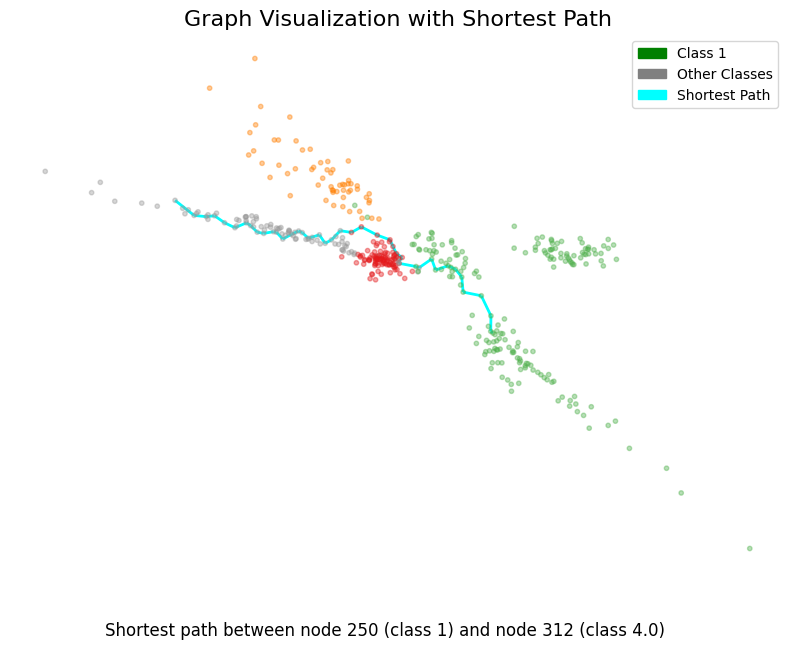
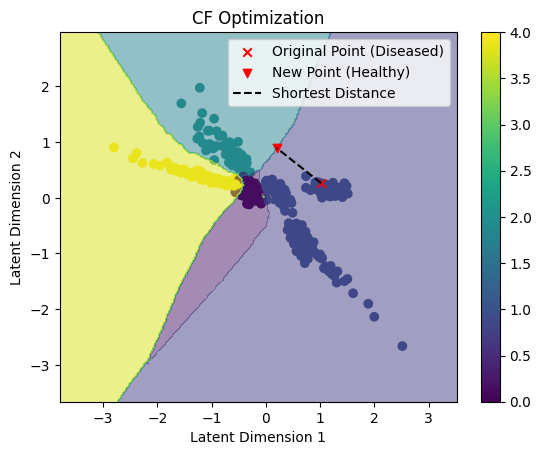

# VAE-Counterfactuals

## Introduction

This project utilizes Variational Autoencoders (VAEs) to generate counterfactuals in data-driven domains. Counterfactuals are hypothetical alternatives to events that have already occurred, providing insights into how outcomes could be different under altered circumstances. By leveraging the generative capabilities of VAEs, this project aims to explore and generate plausible counterfactual examples, which can be particularly useful in fields such as explainable AI (XAI), healthcare, finance, and more.

## Objective

The primary objective of this repository is to develop a framework for generating, evaluating, and utilizing counterfactuals produced by VAEs. This involves:

- Implementing a robust VAE model capable of learning complex data distributions.
- Developing a methodology for generating counterfactuals that are both diverse and closely aligned with real-world data distributions.
- Evaluating the generated counterfactuals based on their plausibility, diversity, and relevance to specific use cases.

